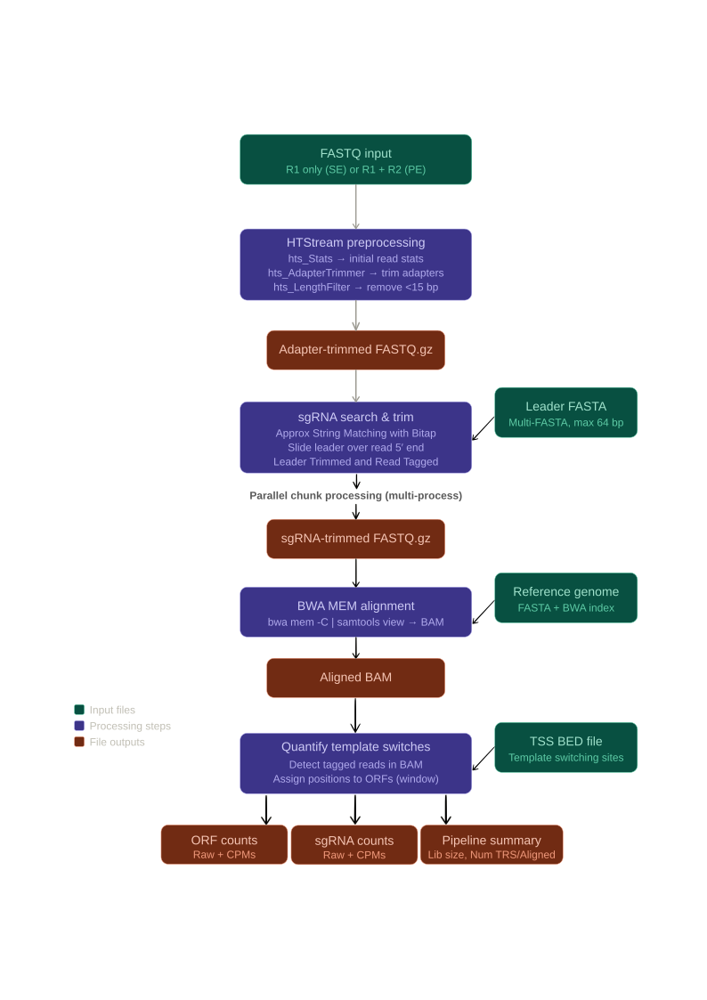

<p align="center">
  
</p>

# sgRNAtor

**Identification and quantification pipeline for subgenomic RNAs (sgRNAs).**

Nidovirales (e.g. SARS-CoV-2) replicate by discontinuous transcription. The
replicase pauses at a transcription-regulatory sequence (TRS-B) upstream of a
body ORF, jumps to the homologous leader TRS (TRS-L) at the 5' end of the
genome, and completes the negative-strand copy. Every mature sgRNA therefore
carries the same genomic **leader sequence** fused directly onto the body of one
ORF, and the position of that fusion junction identifies which sgRNA the read
came from.

sgRNAtor exploits this: it finds reads whose 5' end matches the leader, trims
the leader off, aligns what remains to the viral genome, and treats the
alignment start of each leader-bearing fragment as a template-switching site
(TSS). Those sites are then assigned to annotated ORF junctions to produce
per-ORF and per-junction count tables.

---

## Workflow

<p align="center">
  
</p>

1. **Adapter trimming** (`prepro.py`) — reads are streamed through an HTStream
   pipe: `hts_Stats` → `hts_LengthFilter` (drops reads < 15 bp) →
   `hts_AdapterTrimmer`. Handles SE or PE input.
2. **Leader search & trim** (`search.py`) — each read (and its reverse
   complement, since libraries are treated as unstranded) is searched for every
   leader sequence in the leader FASTA using a **Myers (1999) bit-vector
   approximate matcher**. Two match modes are considered:
   - the *full* leader occurring anywhere in the read (free 5' context), and
   - a *partial 5' overlap*, where the read begins inside the leader and only a
     leader suffix of at least `--min-match` bases is present.

   Both allow up to `--max-edit` substitutions **and indels**. The 5'-most match
   wins. Matching reads are trimmed through the end of the leader and tagged
   `ls:i:{0,1}` (the flag records whether the match was found on the reverse
   complement); only leader-bearing fragments are written out. Reads are
   processed in chunks across a `ProcessPoolExecutor` while output order is
   preserved.
3. **Alignment** (`align.py`) — `bwa mem -C` (carries the `ls` comment through
   into the BAM) piped into `samtools view -b`.
4. **Quantification** (`quantify.py`) — the BAM is parsed with pysam. For each
   fragment, the 3'-most alignment start among its leader-tagged reads becomes
   the template-switching site. Sites are counted, then assigned to an ORF if
   they fall within `± --tss-window` bp of a junction in the TSS BED file.
   Assigned sites are counted as **canonical**, unassigned sites as
   **noncanonical**.
5. **Reporting** (`stats.py`) — writes counts, CPMs, per-read assignments, and a
   run summary.

---

## Input data

sgRNAtor is built for **short-read (Illumina) RNA-seq or amplicon sequencing of
a nidovirus infection**, with reference files for the virus of interest.

| Input | Flag | Description |
| --- | --- | --- |
| FASTQ | positional | R1 (or SE) reads, and optionally R2. Plain or gzipped — detected automatically. |
| Reference FASTA | `-R/--reference` | Viral genome. **Must already be BWA-indexed** (`bwa index`); sgRNAtor errors out if `.amb/.ann/.bwt/.pac/.sa` are missing. |
| Leader FASTA | `-L/--leader-fasta` | Multi-FASTA of leader / TRS-L sequences. Each sequence must be **≤ 64 bp** (the bit-vector matcher uses a single machine word). Multiple variants can be supplied; the first one that matches a read is used. |
| TSS BED | `-b/--tss-bed` | Known template-switching sites. Tab-separated `chrom  start  end  name`; `start` (0-based) is the junction position and `name` is the ORF label. Duplicate start positions are rejected. |

Reference files for SARS-CoV-2 (Wuhan-Hu-1 / `MN908947.3`) ship in `data/`:

```
data/nCoV-2019.reference.fasta              # genome
data/leader_seq.fasta                       # 2 leader variants, 27 bp each
data/sgRNA_template_switch_sites.bed        # 12 junctions (genomic, S, orf3, E, M, orf6, orf7, orf8, N, orf9b, N*, orf10)
data/GCF_009858895.2_ASM985889v3_genomic.gtf
```

`data/sgRNA_template_switch_sites.bed`:

```
MN908947.3	67	68	genomic
MN908947.3	21553	21554	S
MN908947.3	25382	25383	orf3
...
```

---

## Installation

**1. Install conda** (miniconda or miniforge).

**2. Create the environment.** This installs the external binaries the pipeline
shells out to — `bwa`, `samtools`, and `htstream` — alongside the Python
dependencies.

```bash
mkdir -p ./build
conda env create -f environment.yml --prefix $(pwd)/build
```

**3. Activate it.**

```bash
conda activate $(pwd)/build
```

**4. Install the package** from the directory containing `setup.py`.

```bash
pip install .
```

`setup.py` checks `PATH` for `bwa`, `samtools`, `bbduk.sh`, and `htstream` and
warns (but does not fail) if any are missing.

**5. Verify.**

```bash
sgRNAtor --help
```

Requires Python ≥ 3.10.

---

## Usage

```
usage: sgRNAtor [-h] --reference REFERENCE --leader-fasta LEADER_FASTA --tss-bed TSS_BED
                [--threads THREADS] [--min-match MIN_MATCH] [--max-edit MAX_EDIT]
                [--tss-window TSS_WINDOW] [--output-prefix OUTPUT_PREFIX]
                fastq [fastq2]

Identification and Quantification pipeline for sgRNA. Performs leader sequence matching and
trimming, alignment with BWA, and generates sgRNA counts tables.

positional arguments:
  fastq                 Path to the input fastq file (R1 or SE)
  fastq2                Path to optional Read 2 fastq file

options:
  -h, --help            show this help message and exit
  --reference REFERENCE, -R REFERENCE
                        Path to genome reference fasta file.
  --leader-fasta LEADER_FASTA, -L LEADER_FASTA
                        Path to leader sequence multi fasta file. All sequences should be no
                        greater than 64 bp long.
  --tss-bed TSS_BED, -b TSS_BED
                        Path to sgRNA template switching sites bed file.
  --threads THREADS, -t THREADS
                        Number of threads to use (default: 1)
  --min-match MIN_MATCH, -m MIN_MATCH
                        Minimum length of substring to match (default: 12)
  --max-edit MAX_EDIT, -e MAX_EDIT
                        Maximum edit distance for a leader sequence match (default: 2)
  --tss-window TSS_WINDOW, -w TSS_WINDOW
                        Window size for template switching sites (+/- specified number). (default:
                        10)
  --output-prefix OUTPUT_PREFIX, -o OUTPUT_PREFIX
                        Prefix for output files.
```

### Example

```bash
bwa index data/nCoV-2019.reference.fasta

sgRNAtor --reference    data/nCoV-2019.reference.fasta \
         --leader-fasta data/leader_seq.fasta \
         --tss-bed      data/sgRNA_template_switch_sites.bed \
         --threads      12 \
         --min-match    10 \
         --max-edit     2 \
         --tss-window   10 \
         --output-prefix 01-sgRNAQuant/SRR31567433 \
         SRR31567433_1.fq.gz SRR31567433_2.fq.gz
```

See `scripts/basic_sgRNAtor_usage.sh` for this as a runnable template, and
`scripts/paper_implementation.sh` for the SGE array-job version used to
reproduce the published bbduk/bbmap-based approach for comparison.

### Tuning

- `--min-match` is the shortest leader suffix accepted for a read that starts
  inside the leader. Lower it for short reads or heavily fragmented libraries;
  raising it reduces spurious hits.
- `--max-edit` is the Levenshtein budget (substitutions **and** indels) for a
  leader match. `2` tolerates sequencing error and leader variation; `0` is
  exact.
- `--tss-window` widens the ± window around each BED junction. Template
  switching is imprecise, so a small window (10 bp) captures the real spread
  without merging adjacent ORFs.

---

## Outputs

All files are prefixed with `--output-prefix`.

| File | Contents |
| --- | --- |
| `{prefix}_ORF_counts.txt` | `ORF  Start  Stop  Counts  CPMs` — one row per junction in the TSS BED, with its ± window bounds. |
| `{prefix}_sgRNA_counts.txt` | `Pos  Assigned  Counts  CPMs` — one row per observed template-switching site (1-based), with the ORF it was assigned to or `None` if noncanonical. |
| `{prefix}_read_assignments.txt` | `ORF  Reads` — comma-separated read IDs per ORF, plus an `unassigned` row. |
| `{prefix}_summary.txt` | `Library_Size`, `TRS_Found`, `Aligned`, `Canonical`, `Noncanonical`. |
| `{prefix}_sgRNA_R*.fastq.gz` | Leader-trimmed reads. |
| `{prefix}_aligned_sgRNA.bam` | BWA alignment of the trimmed reads. |
| `{prefix}_stats.json`, `{prefix}.stdout/.stderr` | HTStream preprocessing logs. |

CPMs are counts per million of the **total** library size (pre-filtering), so
they are directly comparable across samples.

---

## Repository layout

```
src/sgRNAtor/
  main.py       CLI entry point and pipeline driver
  prepro.py     HTStream adapter trimming / length filtering
  search.py     Myers bit-vector + bitap leader search and trimming
  align.py      BWA MEM → samtools BAM
  quantify.py   BAM → template-switching sites → ORF assignment
  stats.py      Count tables and run summary
  utils.py      FASTA reader, gzip detection, revcomp, interval overlap
scripts/        Runnable usage examples and standalone helpers
  sgRNAQuant.py     Quantify from an existing BAM (skips search/alignment)
  ProcessBams.py    Pandas-based read-start counting around BED junctions
data/           SARS-CoV-2 reference, leader sequences, TSS BED
docs/           Workflow diagram, logo, notes
test/           Unit tests for the Myers and bitap matchers
```

## Tests

```bash
python3 test/test_myers.py
python3 test/test_bitap.py
```

Both add `src/` to `sys.path`, so they run without installing the package
(Biopython is still required).
